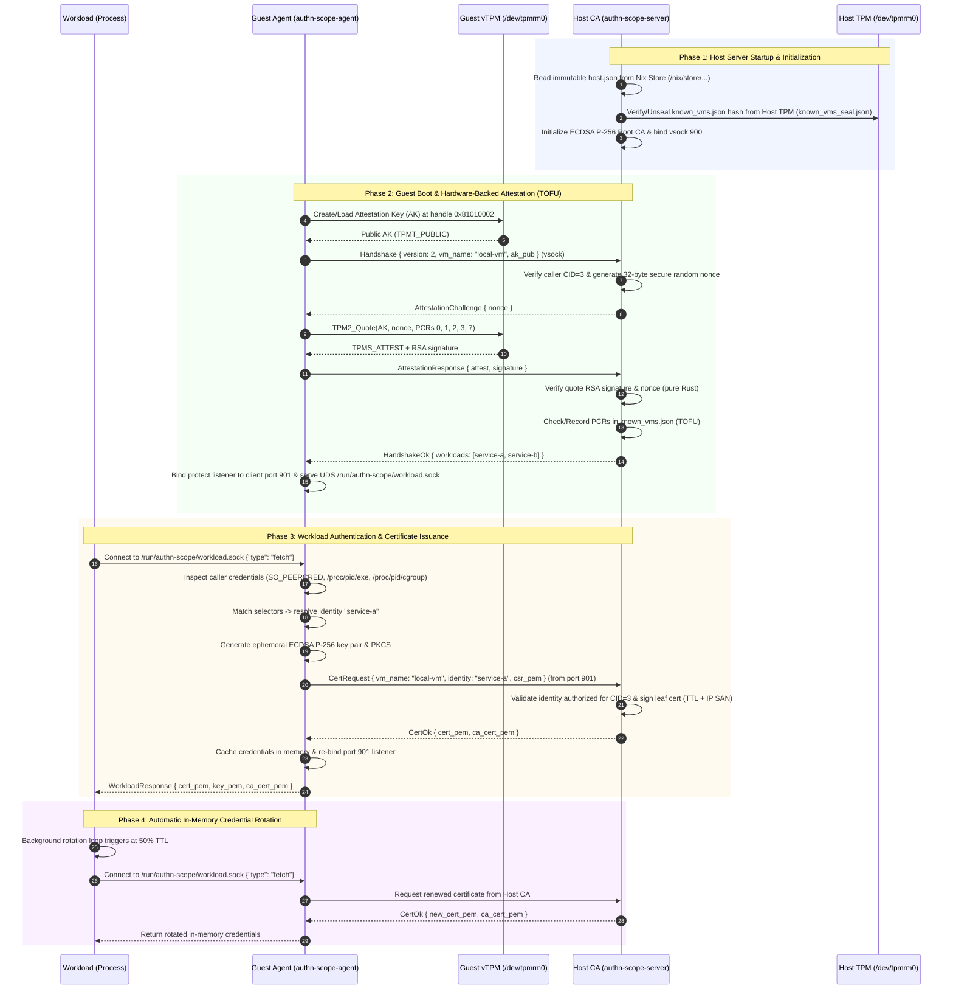

# authn-scope

A pure-Rust, zero-OpenSSL PKI and mutual trust system for issuing X.509 certificates to workloads across a multi-VM Linux vsock environment.

Features hardware-backed **vTPM remote attestation** for guest VM trust (with Trust-On-First-Use) and **host TPM configuration sealing** to protect against host-level tampering.

---

## Architecture Overview

```
┌──── HOST MACHINE ────────────────────────────────────────────────────────┐
│  authn-scope-server                                                      │
│    • Binds vsock server port (default 900) as Root CA                    │
│    • Reads immutable host.json directly from read-only Nix store         │
│    • Host TPM seals /var/lib/authn-scope/known_vms.json against tampering│
│    • Verifies guest vTPM quotes (PCRs 0, 1, 2, 3, 7) via TOFU            │
│    • Issues ephemeral ECDSA P-256 X.509 certs on demand                 │
└────────────────────────────────────┬─────────────────────────────────────┘
                                     │ vsock (length-prefixed JSON framing)
┌──── GUEST VM (CID N) ──────────────▼─────────────────────────────────────┐
│  authn-scope-agent                                                       │
│    • Discovers vTPM device (/dev/tpmrm0 or /dev/tpm0)                    │
│    • Manages Attestation Key (AK) & answers server TPM2_Quote challenge  │
│    • Serves local Workload API over Unix Domain Socket                   │
│    • Attests calling processes (UID/GID, binary path, systemd service)   │
│    • Performs automatic in-memory credential rotation (at 50% TTL)       │
└──────────────────────────────────────────────────────────────────────────┘
```

---

## Workspace Crate Layout

| Crate / Directory | Language | Role |
|---|---|---|
| `libs/rust-libs/authn-scope-proto` | Rust | Wire protocol types (`AgentRequest`/`AgentResponse`), framing codecs |
| `libs/rust-libs/authn-scope-ca` | Rust | Pure-Rust CA engine: P-256 key generation, CSR signing, leaf cert creation |
| `libs/rust-libs/authn-scope-tpm` | Rust | TPM 2.0 operations: AK creation, TPM2_Quote generation, verification, config sealing |
| `libs/rust-libs/authn-scope-workload` | Rust | Workload client library: sync fetch, in-memory caching, background rotation loop |
| `libs/rust-libs/authn-scope-evaluator` | Rust | Peer certificate evaluation & signature verification utility |
| `apps/rust-apps/authn-scope-server` | Rust | Host CA server daemon with TPM sealing and attestation handling |
| `apps/rust-apps/authn-scope-agent` | Rust | Guest VM agent with vTPM attestation and local Workload API server |
| `apps/rust-apps/workload-test-workload` | Rust | Test workload verifying attestation and rotation |
| `apps/rust-apps/profiler` | Rust | Memory footprint (VmRSS) and latency benchmark utility |
| `libs/go-libs/authn-scope-workload` | Go | Go client library for the Workload API with background rotation |
| `libs/go-libs/authn-scope-evaluator` | Go | Go peer certificate evaluation & signature verification utility |

---

## Complete End-to-End Workflow



---

## Hardware-Backed Trust Model

### 1. Guest vTPM Attestation & TOFU
1. The guest agent creates a persistent Attestation Key (AK) in its vTPM.
2. During the vsock handshake, the agent sends its public AK to the host.
3. The server challenges the agent with a 32-byte cryptographic random nonce (`AttestationChallenge`).
4. The agent signs a quote over PCRs 0, 1, 2, 3, 7 with the nonce.
5. The server verifies the RSA signature in software.
6. **Trust-On-First-Use (TOFU)**: On the first boot, the server records the PCR digest in `/var/lib/authn-scope/known_vms.json`. On subsequent boots, any mismatch (e.g. tampered firmware or bootloader) immediately aborts the handshake.

### 2. Host TPM Sealing of TOFU State (`known_vms.json`)
To prevent an offline attacker or untrusted process on the host from modifying the learned guest PCR baselines, the SHA-256 hash of `/var/lib/authn-scope/known_vms.json` is **sealed directly into the Host TPM** (`known_vms_seal.json`). On startup, the server verifies that `known_vms.json` has not been tampered with before trusting any guest VM connections.

---

## Configuration Reference

### Host (`/etc/authn-scope/host.json`)

```json
{
  "ca_cert_path": "/etc/authn-scope/ca/ca-cert.pem",
  "ca_key_path": "/etc/authn-scope/ca/ca-key.pem",
  "server_port": 900,
  "peer_port": 901,
  "vms": {
    "local-vm": {
      "vm_cid": 3,
      "ip": "127.0.0.1",
      "attestation": {
        "required": true
      },
      "identities": {
        "service-a": {
          "selector": "unix:user:service-a,unix:group:service-a,systemd:unitname:service-a",
          "ttl_minutes": 10
        },
        "service-b": {
          "selector": "unix:user:service-b,unix:group:service-b",
          "ttl_minutes": 60
        }
      }
    }
  }
}
```

### Guest Agent (`/etc/authn-scope/agent.json`)

```json
{
  "vm_name": "local-vm",
  "server_port": 900,
  "client_port": 901,
  "workload_api_socket": "/run/authn-scope/workload.sock"
}
```

---

## Host Prerequisites & vTPM Setup

To run guest VMs with hardware-backed vTPM attestation, ensure the host meets the following prerequisites and hypervisor configuration.

### 1. Host Package & Kernel Prerequisites

The host requires QEMU (with TPM support), `swtpm` (software TPM emulator), and the Linux `vhost_vsock` kernel module:

```bash
# Ubuntu / Debian
sudo apt install qemu-system-x86 swtpm swtpm-tools tpm2-tools

# Arch Linux
sudo pacman -S qemu-base swtpm tpm2-tools

# NixOS / Nix Flake (automatic via nix develop)
nix develop
```

Load the vsock driver on the host:
```bash
sudo modprobe vhost_vsock
```

---

### 2. Setting Up vTPM for a Guest VM

For each guest VM requiring remote attestation, prepare an emulated TPM 2.0 instance on the host:

#### Step A: Initialize vTPM NVRAM & Certificates
```bash
mkdir -p /var/lib/swtpm-guest1
swtpm_setup \
  --tpm-state /var/lib/swtpm-guest1 \
  --tpm2 \
  --create-ek-cert \
  --create-platform-cert
```

#### Step B: Start the `swtpm` Daemon for the Guest
```bash
swtpm socket \
  --tpmstate dir=/var/lib/swtpm-guest1 \
  --ctrl type=unixio,path=/var/run/swtpm-guest1.sock \
  --tpm2 \
  --flags not-need-init \
  --daemon
```

---

### 3. Hypervisor / QEMU Parameters for Guest

When launching the guest VM with QEMU, attach both the `vhost-vsock` device and the vTPM chardev socket:

```bash
qemu-system-x86_64 \
  -enable-kvm -m 2048 -smp 2 \
  -drive file=guest-disk.qcow2,if=virtio \
  -device vhost-vsock-pci,guest-cid=3 \
  -chardev socket,id=chrtpm,path=/var/run/swtpm-guest1.sock \
  -tpmdev emulator,id=tpm0,chardev=chrtpm \
  -device tpm-tis,tpmdev=tpm0
```

> **Note for ARM64 / aarch64**: Replace `-device tpm-tis,tpmdev=tpm0` with `-device tpm-tis-device,tpmdev=tpm0` or `tpm-crb`.

---

### 4. Multi-VM Socket Architecture & Isolation

| Socket Type | Shared Across VMs? | Scope & Reason |
|---|---|---|
| **vTPM Socket (`swtpm`)** | ❌ **No (1 per VM)** | **Isolated**. Each VM has its own hardware registers (PCRs 0–23), NVRAM, and Endorsement/Attestation Keys. Sharing a vTPM socket causes PCR measurement corruption, session race conditions, and cryptographic identity collisions. |
| **Host CA vsock (`vsock:900`)** | ✅ **Yes (Shared)** | **Multiplexed**. All VMs dial `host_cid=2, port=900`. The server identifies callers using their distinct Linux vsock `CID` (e.g. CID 3, CID 4). |
| **Workload UDS (`workload.sock`)** | ✅ **Yes (Per-VM)** | **Shared by local processes**. All workloads inside VM-1 share VM-1's `/run/authn-scope/workload.sock`. The agent inspects `SO_PEERCRED` to identify each calling process. |

#### Multi-VM Launch Pattern:

```bash
# VM 1 (CID 3)
swtpm socket --tpmstate dir=/var/lib/swtpm/vm1 --ctrl type=unixio,path=/var/run/swtpm/vm1.sock --tpm2 --flags not-need-init --daemon
qemu-system-x86_64 ... -device vhost-vsock-pci,guest-cid=3 -chardev socket,id=chrtpm,path=/var/run/swtpm/vm1.sock -tpmdev emulator,id=tpm0,chardev=chrtpm -device tpm-tis,tpmdev=tpm0

# VM 2 (CID 4)
swtpm socket --tpmstate dir=/var/lib/swtpm/vm2 --ctrl type=unixio,path=/var/run/swtpm/vm2.sock --tpm2 --flags not-need-init --daemon
qemu-system-x86_64 ... -device vhost-vsock-pci,guest-cid=4 -chardev socket,id=chrtpm,path=/var/run/swtpm/vm2.sock -tpmdev emulator,id=tpm0,chardev=chrtpm -device tpm-tis,tpmdev=tpm0
```

---

### 5. Inside the Guest VM

Once each VM boots with its respective parameters:
1. The Linux kernel initializes the `tpm_tis` driver, presenting `/dev/tpmrm0` (TPM Resource Manager) and `/dev/tpm0`.
2. `authn-scope-agent` auto-detects `/dev/tpmrm0` on startup, creates the Attestation Key (AK), and completes the attestation handshake with the host server.

Workloads inside the guest VM fetch credentials over `/run/authn-scope/workload.sock` with zero file I/O:

### Rust Example

```rust
use std::time::Duration;
use authn_scope_workload::WorkloadClient;

#[tokio::main]
async fn main() -> Result<(), Box<dyn std::error::Error>> {
    let client = WorkloadClient::new("/run/authn-scope/workload.sock");

    // Fetch initial credentials
    let creds = client.fetch_credentials().await?;
    println!("Cert: {}", creds.cert_pem);

    // Automatic background rotation
    client.start_rotation_loop(Duration::from_secs(30));

    Ok(())
}
```

### Go Example

```go
package main

import (
    "fmt"
    "log"
    "time"

    workload "authn-scope-workload"
)

func main() {
    client := workload.NewWorkloadClient("/run/authn-scope/workload.sock")

    creds, err := client.FetchCredentials()
    if err != nil {
        log.Fatalf("Fetch error: %v", err)
    }
    fmt.Printf("Cert: %s\n", creds.CertPEM)

    // Background rotation
    client.StartRotationLoop(30 * time.Second)
}
```

---

## Build & Development

### Using Nix (Recommended)

Enter the reproducible development shell (provisions Rust, Go, QEMU, `tpm2-tss`, `tpm2-tools`, `swtpm`):

```bash
nix develop
```

### Build Workspace

```bash
cargo build --release
```

### Run Tests

```bash
# End-to-end integration test with QEMU + swtpm vTPM:
sudo ./scripts/run_integration_test.sh

# NixOS module VM test:
run-nixos-module-test

# Performance & memory profiler:
run-profiler
```

---

## CLI Reference

### Host Server (`authn-scope-server`)

```bash
# Start server (generates CA keys if --genkey is passed)
sudo authn-scope-server --config /etc/authn-scope/host.json --genkey

# Reset attestation (TOFU) state for a VM after a legitimate OS image rebuild (automatically re-seals known_vms.json)
sudo authn-scope-server --reset-attestation local-vm
```

### Guest Agent (`authn-scope-agent`)

```bash
# Start agent daemon
sudo authn-scope-agent --config /etc/authn-scope/agent.json
```

---

## Documentation

- [Threat Model & Attack Analysis](docs/threat_model.md)
- [Design Document](docs/design.md)
- [Server Configuration Reference](docs/server_configuration.md)
- [Agent Configuration Reference](docs/agent_configuration.md)
- [Rust Workload API Guide](docs/api_rust.md)
- [Go Workload API Guide](docs/api_go.md)
