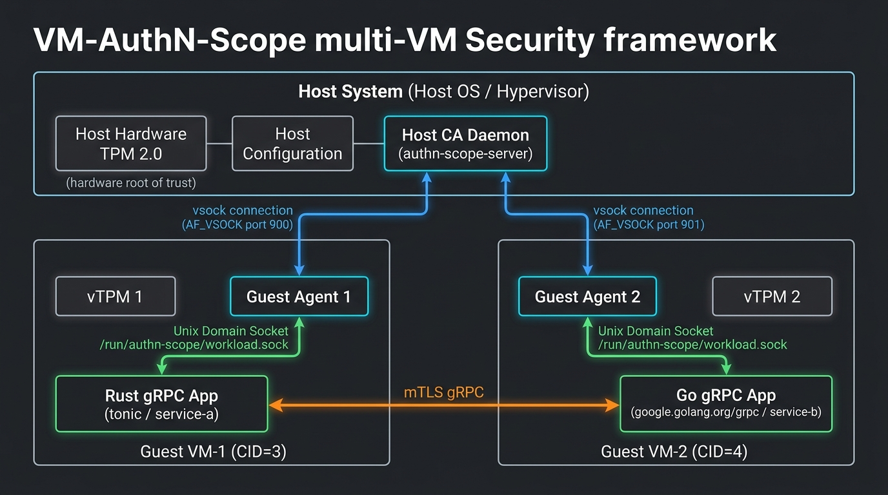
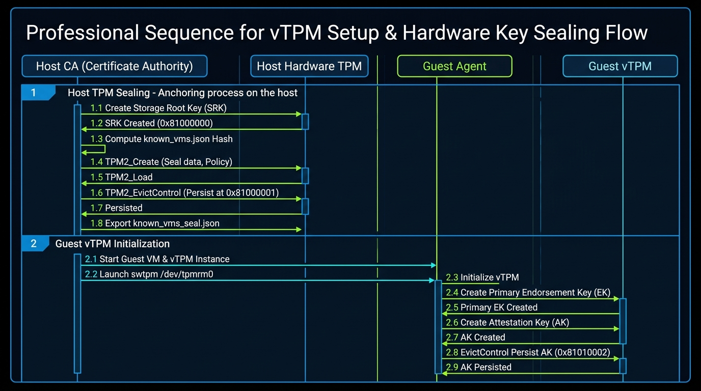
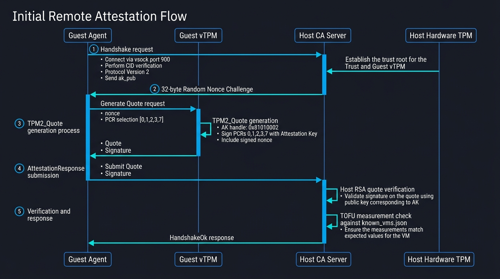
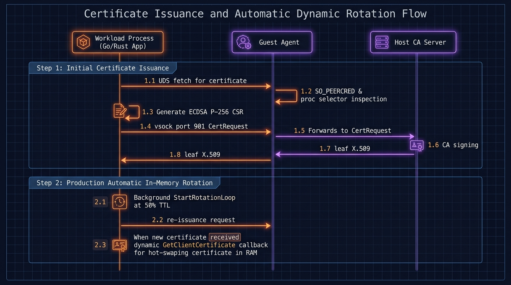
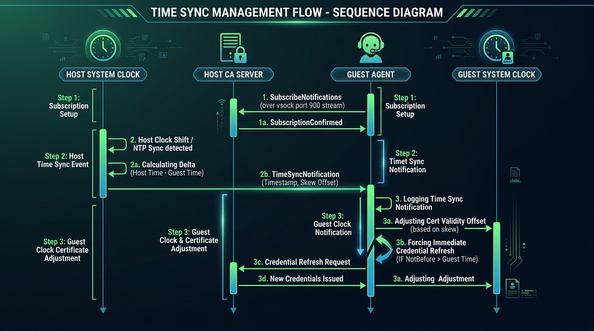

# VM-AuthN-Scope: vsock Certificate Authority & Workload API — Design Document

## Overview

A pure-Rust (zero OpenSSL/C crypto library) PKI and attestation system for multi-VM Linux environments.
The **host CA** issues X.509 certificates over vsock with mutual hardware-backed trust established via **vTPM attestation** and **host TPM configuration sealing**.
Each **guest VM** runs an agent that authenticates with the host CA and exposes a local **Workload API** (over a Unix Domain Socket) to provision ephemeral X.509 certificates to local processes based on fine-grained process selectors.

---

## Design Decisions

| Scope | Implementation |
| --- | --- |
| Key algorithm | ECDSA P-256 (Leaf & CA) |
| vsock transport | Length-prefixed JSON framing over vsock |
| Trust Establishment | vTPM remote attestation (`TPM2_Quote` over PCRs 0, 1, 2, 3, 7) with TOFU |
| Config & State Integrity | Immutable Nix Store for `host.json` + Host TPM sealing of `known_vms.json` |
| Credential Delivery | On-demand via local Workload API Unix Domain Socket (no disk storage) |
| Credential Rotation | Automatic in-memory rotation at 50% certificate TTL (`ttl_minutes / 2`) |
| Key generation | `--genkey` CLI flag (regenerates/overwrites CA keys and starts server in a single step) |
| Process Attestation | Linux peer credentials (`SO_PEERCRED`), `/proc/<pid>/exe`, and `/proc/<pid>/cgroup` |
| Server privilege enforcement | Requires root privilege to run (due to vsock bind constraints) |
| Client TLS Mechanism | Production dynamic `GetClientCertificate` / `GetCertificate` TLS callbacks (Go & Rust) |

---

## Architecture

### System Architecture Overview



---

## Execution Flows

### 1. vTPM Setup & Hardware Key Sealing Flow



#### Technical Breakdown:
1. **Host TPM Storage Primary Key (SRK)**: Host CA initializes SRK at persistent handle `0x81000000` via `/dev/tpmrm0`.
2. **Configuration Sealing**: Computes SHA-256 hash of `known_vms.json` TOFU policy and seals state hash into `known_vms_seal.json` via `TPM2_Create` and `TPM2_EvictControl`.
3. **Guest vTPM Key Persistence**: Guest agent opens `swtpm` character device `/dev/tpmrm0`, generates Primary Endorsement Key (EK), and creates a persistent Attestation Key (AK) at handle `0x81010002`.

---

### 2. Initial Remote Attestation Flow



#### Technical Breakdown:
1. **vsock Handshake**: Guest agent connects to host CA over `vsock` port 900 (`version: 2`, `vm_name`, `ak_pub`). Server validates caller vsock CID matches VM configuration (e.g. CID=3 for VM-1).
2. **Challenge-Response Nonce**: Host CA generates a cryptographically secure 32-byte random challenge nonce.
3. **Hardware PCR Quote**: Guest agent invokes `TPM2_Quote` signed by persistent AK handle `0x81010002` over PCRs 0, 1, 2, 3, 7 and the challenge nonce.
4. **Signature & Policy Verification**: Host CA verifies the RSA signature over `TPMS_ATTEST` using `ak_pub`, asserts nonce equivalence, and validates PCR measurements against `known_vms.json` TOFU policy.

---

### 3. Certificate Issuance & Automatic Dynamic Rotation Flow



#### Technical Breakdown:
1. **Process Selector Inspection**: Local process connects to UDS `/run/authn-scope/workload.sock`. Guest agent validates caller process credentials via `SO_PEERCRED`, `/proc/<pid>/exe`, and `/proc/<pid>/cgroup`.
2. **CSR & Issuance**: Agent generates an in-memory ECDSA P-256 keypair, submits PKCS#10 CSR to host CA over vsock port 901, and returns leaf X.509 certificate.
3. **Production Dynamic TLS Callbacks**: Workload process starts background `StartRotationLoop(5s)` and uses `GetClientCertificate` (Go) / dynamic cert resolver (Rust) to hot-swap updated certificates in RAM at 50% TTL threshold without application restarts or connection re-dials.

---

### 4. Time Sync Management Flow



#### Technical Breakdown:
1. **vsock Notification Subscription**: Guest agent subscribes to host notifications over `vsock` port 900 streaming channel (`SubscribeNotifications`).
2. **Host Clock Shift Detection**: Host CA monitors system time shifts / NTP sync events and broadcasts `TimeSyncNotification` containing new timestamp and calculated skew offset.
3. **Guest Adjustment**: Guest agent logs notification, adjusts validity offset calculation, and triggers immediate credential refresh if certificate `NotBefore` exceeds guest local clock.

---

## Wire Protocol

A length-prefixed JSON protocol over the vsock channel:

```
[4-byte big-endian length][JSON payload bytes]
```

### 1. Handshake Request (agent → server)

```json
{
  "type": "handshake",
  "version": 2,
  "vm_name": "local-vm",
  "ak_pub": "<base64-encoded TPMT_PUBLIC bytes>"
}
```

### 2. Attestation Challenge (server → agent)

```json
{
  "status": "attestation_challenge",
  "nonce": "<base64-encoded 32-byte random nonce>"
}
```

### 3. Attestation Response (agent → server)

```json
{
  "type": "attestation_response",
  "attest": "<base64-encoded TPMS_ATTEST bytes>",
  "signature": "<base64-encoded TPMT_SIGNATURE bytes>"
}
```

### 4. Handshake Response (server → agent)

```json
{
  "status": "handshakeok",
  "workloads": {
    "service-a": {
      "selector": {
        "unix": {
          "user": "service-a",
          "group": "service-a",
          "bin-path": "/usr/local/bin/service-a"
        },
        "systemd": {
          "unitname": "service-a"
        }
      },
      "validity_seconds": 600
    }
  }
}
```

### 5. On-Demand CertRequest (agent → server)

```json
{
  "type": "cert_request",
  "version": 2,
  "vm_name": "local-vm",
  "identity": "service-a",
  "csr_pem": "-----BEGIN CERTIFICATE REQUEST-----\n..."
}
```

### 6. CertResponse (server → agent)

```json
{
  "status": "certok",
  "cert_pem": "-----BEGIN CERTIFICATE-----\n...",
  "ca_cert_pem": "-----BEGIN CERTIFICATE-----\n..."
}
```

### 7. Subscribe Notifications Request (agent → server)

```json
{
  "type": "subscribe_notifications",
  "version": 2,
  "vm_name": "local-vm"
}
```

### 8. Time Sync Notification (server → agent)

```json
{
  "status": "time_sync_notification",
  "timestamp": 1756740000
}
```

---

## Configuration Schema

### Host config (`/etc/authn-scope/host.json`)

```json
{
  "ca_cert_path": "/etc/authn-scope/ca/ca-cert.pem",
  "ca_key_path": "/etc/authn-scope/ca/ca-key.pem",
  "server_port": 900,
  "peer_port": 901,
  "vms": {
    "local-vm": {
      "vm_cid": 3,
      "ip": "127.0.0.1",
      "attestation": {
        "required": true
      },
      "identities": {
        "service-a": {
          "selector": "unix:user:service-a,unix:group:service-a,systemd:unitname:service-a",
          "ttl_minutes": 10
        },
        "service-b": {
          "selector": "unix:user:service-b,unix:group:service-b",
          "ttl_minutes": 60
        }
      }
    }
  }
}
```

### Guest/Agent config (`/etc/authn-scope/agent.json`)

```json
{
  "vm_name": "local-vm",
  "server_port": 900,
  "client_port": 901,
  "workload_api_socket": "/run/authn-scope/workload.sock"
}
```

---

## Secure Port Binding & Verification

1. **Client Port (Peer) Verification**:
   When the server accepts a connection, it verifies the client source port (`peer_addr.port()`). The server requires the client to bind to `peer_port` (default `901`). Connections from other ports are rejected.
2. **Server-Side Privilege Verification**:
   The server daemon binds to a low-numbered port (`server_port`, default `900`). The kernel limits bindings on these ports to privileged processes running as `root`.
3. **VM Identity Matching**:
   The guest agent sends its expected `vm_name` in the handshake request. The server looks up this VM and validates that the connection's source CID matches `vm_cid`.
4. **vTPM Hardware Attestation**:
   The guest proves its boot integrity by signing PCR measurements (0, 1, 2, 3, 7) with its TPM Attestation Key.

---

## File & Module Layout

```
authn-scope/
├── Cargo.toml               # workspace root
├── Cargo.lock
│
├── docs/
│   ├── design.md            # design specification & embedded sequence diagrams
│   └── images/              # rendered architectural & sequence diagram images
│
├── libs/
│   ├── rust-libs/
│   │   ├── authn-scope-proto/     # wire types, framing codecs, protocol versions
│   │   ├── authn-scope-ca/        # pure-Rust CA engine, CSR signing
│   │   ├── authn-scope-tpm/       # TPM 2.0 AK management, quote verification, sealing
│   │   ├── authn-scope-workload/  # Rust client library for Workload API
│   │   └── authn-scope-evaluator/ # certificate verification library
│   └── go-libs/
│       ├── authn-scope-workload/  # Go client library for Workload API
│       └── authn-scope-evaluator/ # Go certificate verification library
│
├── testapp/
│   ├── proto/                     # shared echo.proto gRPC service definition
│   ├── grpc-app-rust/             # Rust gRPC test workload (tonic + prost + mTLS)
│   └── grpc-app-go/               # Go gRPC test workload (google.golang.org/grpc + mTLS)
│
└── apps/
    └── rust-apps/
        ├── authn-scope-server/        # host CA daemon with TPM sealing & attestation
        ├── authn-scope-agent/         # guest agent with Workload API & vTPM quote
        ├── workload-test-workload/    # test workload for rotation verification
        └── profiler/                  # memory and latency profiling benchmark
```

---

## References & Further Reading

* [Threat Model & Attack Analysis](threat_model.md)
* [Server Configuration Reference](server_configuration.md)
* [Agent Configuration Reference](agent_configuration.md)
* [Rust Workload API Guide](api_rust.md)
* [Go Workload API Guide](api_go.md)
