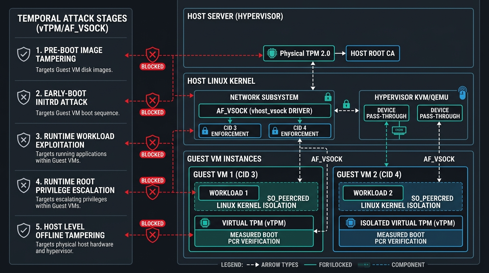
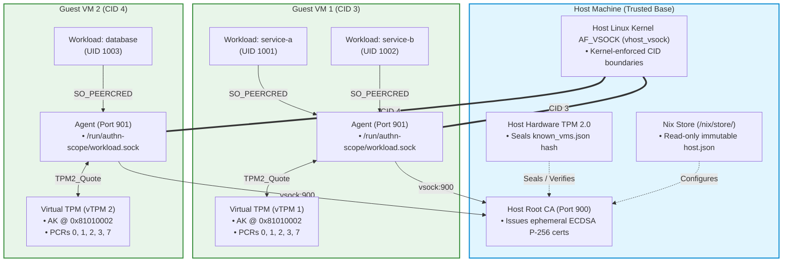
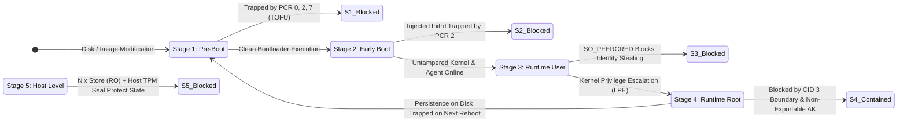

# VM-AuthN-Scope Threat Model & Attack Analysis

This document provides a comprehensive security and threat modeling analysis of the **VM-AuthN-Scope** architecture. It analyzes system assets, trust boundaries, attacker capabilities across different stages of the lifecycle (pre-boot, early-boot, runtime unprivileged, runtime root, and host-level), and formal STRIDE mitigations.

---

## 1. System Assets & Security Boundaries

### Primary Assets & Protection Goals

| Asset | Location | Security Objective | Primary Defense |
|---|---|---|---|
| **Root CA Private Key** | Host (`ca-key.pem`) | Confidentiality & Integrity | Strict `root:root 0600` access; never leaves host memory. |
| **Host Policy (`host.json`)** | Host Nix Store | Integrity & Immutability | Read-only Nix Store; cryptographically pinned by system closure. |
| **TOFU Ledger (`known_vms.json`)** | Host (`/var/lib/authn-scope`) | Integrity | Sealed into **Host Hardware TPM** (`known_vms_seal.json`). |
| **Attestation Private Key (AK)** | Guest vTPM NVRAM | Confidentiality | Non-exportable (`fixedTPM = true`); restricted signing key. |
| **PCR Registers (0, 1, 2, 3, 7)** | Guest vTPM Engine | Tamper-Evidence | Read-only to OS; extended only via cryptographically chained hashes. |
| **Workload Private Keys** | Guest RAM | Confidentiality | Ephemeral in-memory only (zero disk storage); 10-minute TTL. |

---

## 2. Attack Scenarios by Attack Stage

Security depends heavily on **when** an attacker compromises a component. Below is a breakdown across all 5 operational stages:

---

### Scenario 1: Pre-Boot Attack (Offline Disk & Image Tampering)

* **Attacker Capability**: An attacker modifies the guest virtual disk image before the VM is powered on (e.g. injecting a rootkit into `/boot/vmlinuz`, modifying `initrd`, replacing `authn-scope-agent`, or tampering with virtual UEFI NVRAM).
* **Execution & Defenses**:
  1. The VM powers on. Virtual UEFI firmware (OVMF) initializes.
  2. The bootloader measures the altered kernel and initrd into **PCR 2** and **PCR 7**.
  3. The agent sends its handshake and receives an `AttestationChallenge` containing a fresh 32-byte nonce.
  4. The vTPM signs a quote over the *actual* altered PCRs using its hardware AK.
  5. The Host CA checks the quote against `known_vms.json`.
* **Outcome**: 🔴 **ATTACK BLOCKED**. The PCR digest differs from the baseline. The Host CA immediately terminates the vsock connection and records an attestation violation. **Zero certificates are issued.**

---

### Scenario 2: Early Boot Attack (During Initrd / Early Init Phase)

* **Attacker Capability**: An attacker attempts to intercept boot execution inside `initrd` before `systemd` or `authn-scope-agent` starts.
* **Execution & Defenses**:
  1. In a NixOS VM, the `initrd` contains the measured boot scripts.
  2. Any injected script in `initrd` alters the initrd checksum measured in **PCR 2**.
  3. If the attacker tries to fake PCR values, the vTPM hardware rejects arbitrary writes (PCRs can only be *extended*, not set).
* **Outcome**: 🔴 **ATTACK BLOCKED**. Altered boot scripts mutate the PCR register values, triggering immediate rejection by the Host CA.

---

### Scenario 3: Runtime Unprivileged Workload Compromise (Post-Boot)

* **Attacker Capability**: A workload running inside the VM (e.g. `service-b`, running as `UID 1002`) suffers a Remote Code Execution (RCE) vulnerability.
* **Attacker Goal**: Steal credentials belonging to `service-a` (`UID 1001`) or forge an administrative certificate.
* **Execution & Defenses**:
  1. The compromised `service-b` process connects to `/run/authn-scope/workload.sock` requesting `{"type": "fetch"}`.
  2. `authn-scope-agent` queries the Linux kernel for the connection's peer credentials via `getsockopt(SO_PEERCRED)`.
  3. The kernel returns `UID 1002`, `GID 1002`, and `PID`.
  4. The agent inspects `/proc/<pid>/exe` and `/proc/<pid>/cgroup` and cross-checks with the policy rules received from the host.
  5. The agent sees that `UID 1002` only matches `service-b` and **refuses to issue `service-a` credentials**.
* **Outcome**: 🔴 **ATTACK CONTAINED**. The compromised workload cannot access credentials of other workloads on the same VM.

---

### Scenario 4: Runtime Privilege Escalation to Full Root in Guest VM

* **Attacker Capability**: An attacker exploits a local kernel vulnerability (LPE) or misconfigured setuid binary inside **Guest VM-1**, obtaining full `root` (`UID 0`).
* **Detailed Attack Vectors & System Responses**:

#### Vector 4A: Attempting to Steal the vTPM Private Attestation Key (AK)
* Root runs debuggers or kernel modules to dump `/dev/tpmrm0`.
* **Outcome**: 🔴 **BLOCKED**. The private key never resides in guest RAM. It is stored inside the host `swtpm` NVRAM with `fixedTPM = true`. The TPM hardware protocol provides no mechanism to export private keys.

#### Vector 4B: Attempting to Forge Attestation Quotes for Fake PCRs
* Root attempts to call `TPM2_Sign(AK, fake_pcr_data)`.
* **Outcome**: 🔴 **BLOCKED**. The AK is created as a **Restricted Signing Key** (`TPMA_OBJECT_RESTRICTED`). The vTPM firmware rejects `TPM2_Sign` with `TPM_RC_RESTRICTED_KEY`. Only `TPM2_Quote` is permitted, which automatically reads the true hardware PCR registers.

#### Vector 4C: Attempting Cross-VM Impersonation (VM-1 Root attacking VM-2)
* Root on VM-1 kills `authn-scope-agent`, binds privileged port `901`, and dials the Host CA requesting credentials for `service-b` (assigned to VM-2).
* **Outcome**: 🔴 **BLOCKED**. 
  * The Linux host kernel stamps the vsock connection with `peer_cid = 3` (VM-1).
  * The Host CA verifies `peer_cid` against `host.json`.
  * The Host CA sees `service-b` is restricted to `vm-2` (`CID 4`) and rejects the request:
    `"Error: VM 'vm-1' (CID 3) is not authorized for identity 'service-b'"`

#### Vector 4D: Access to VM-1's Own Identities
* Root on VM-1 requests certificates for `service-a` (which is legitimately assigned to VM-1).
* **Outcome**: 🟡 **PERMITTED FOR VM-1 ONLY (Contained Blast Radius)**:
  * Because root owns VM-1, it can obtain short-lived (10-minute) certificates for VM-1's authorized workloads.
  * **Blast Radius**: 100% isolated to VM-1. Zero impact on VM-2, zero access to Host CA keys, zero cross-VM lateral movement.

#### Vector 4E: Establishing Persistence Across Reboots
* Root installs a persistent backdoor kernel module or modifies `/etc/systemd/` on disk.
* **Outcome**: 🔴 **TRAPPED ON REBOOT**.
  * When the VM restarts, the firmware/bootloader measures the modified kernel/modules into **PCRs 2 and 7**.
  * On the next boot handshake, the quote fails verification against `known_vms.json`.
  * The Host CA permanently cuts off the VM until an administrator intervenes.

---

### Scenario 5: Host-Level Attack (Host Compromise or Offline Tampering)

* **Attacker Capability**: An attacker has offline access to the host storage or unprivileged access on the host.

#### Vector 5A: Tampering with Host Configuration (`host.json`)
* **Defense**: `host.json` is generated declaratively by NixOS and stored in the read-only, cryptographically hashed `/nix/store/`. Modifying it requires rebuilding the NixOS system closure.

#### Vector 5B: Tampering with Learned VM Baselines (`known_vms.json`)
* **Defense**: The SHA-256 hash of `known_vms.json` is sealed into the **Host Physical TPM** under the Storage Root Key (`known_vms_seal.json`).
* If an attacker modifies `known_vms.json` to trust a malicious VM image, `authn-scope-server` detects that the unsealed TPM hash does not match the file on disk and **refuses to start**.

---

## 3. STRIDE Threat Analysis Matrix

| Threat (STRIDE) | Target Component | Attack Description | Mitigation in VM-AuthN-Scope | Risk Level |
|---|---|---|---|:---:|
| **Spoofing** | Guest Agent $\rightarrow$ Host CA | Rogue VM pretends to be VM-1 | **vTPM AK binding + Nonce challenge + Kernel vsock CID authentication**. | **LOW** |
| **Spoofing** | Workload $\rightarrow$ Agent | Unprivileged process requests another workload's cert | **Kernel-enforced `SO_PEERCRED` + `/proc/<pid>/exe` inspection**. | **LOW** |
| **Tampering** | Guest Boot Environment | Attacker modifies guest kernel or bootloader | **Hardware Measured Boot (PCRs 0, 1, 2, 3, 7) + TOFU enforcement**. | **LOW** |
| **Tampering** | Host Policy & TOFU State | Attacker modifies `host.json` or `known_vms.json` | **Read-Only Nix Store + Host TPM Sealing (`known_vms_seal.json`)**. | **LOW** |
| **Repudiation** | Certificate Issuance | Rogue workload claims it did not request a cert | **Structured audit logging on Host CA with CID, timestamp, and identity**. | **LOW** |
| **Information Disclosure** | Workload Private Keys | Attacker reads certificates from disk | **In-memory ephemeral storage only (zero disk writes) + 10-minute TTL**. | **LOW** |
| **Information Disclosure** | vTPM Attestation Key | Attacker extracts private AK from VM | **Hardware NVRAM protection (`fixedTPM = true`, non-exportable)**. | **NONE** |
| **Denial of Service** | Host CA vsock Listener | Flooding host vsock port 900 | **vsock connection limiting + kernel-level CID filtering**. | **MED** |
| **Elevation of Privilege** | Local Guest Workload | Privilege escalation from unprivileged user to root | **VM boundary containment: Root cannot cross CIDs or access other VMs**. | **LOW** |

---

## 4. Key Security Guarantees

1. **Hardware-Anchored Identity**: No software running inside a guest VM can forge a valid attestation quote without the physical/emulated TPM hardware.
2. **Strict Hypervisor Isolation**: Compromising one guest VM (even to root) provides **zero lateral movement** to other guest VMs or the host CA.
3. **No Secret Persistence**: Workload private keys never touch disks and automatically expire after short TTLs (default 10 minutes).
4. **Tamper-Evident Host State**: The host's own TOFU state database is cryptographically sealed into the host's physical TPM.
